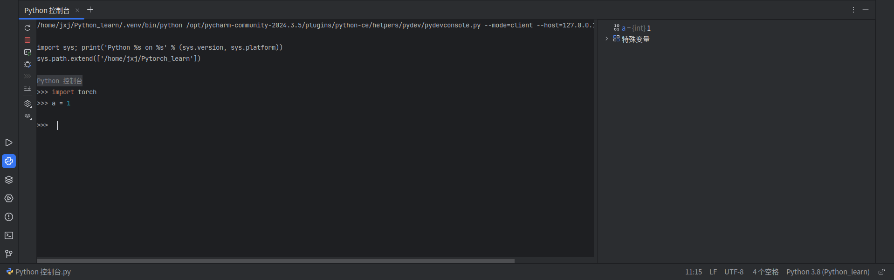
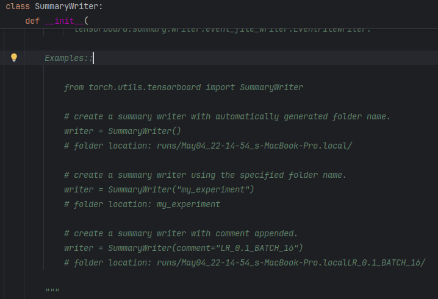
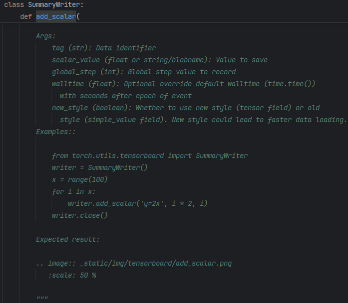

## Pytorch学习笔记1

### 1.1 PyTorch环境配置

#### 1.1.1 Anaconda安装

由于Python中存在很多的第三方软件包，而且版本较多，所以在实际应用中往往会对于不同的工程有不同的开发环境，为了解决这个问题，可以选择使用虚拟环境的方法，具体的为安装Anaconda并利用该软件创建不同的虚拟环境以应对不同的工程需求。

**对于Linux系统**

安装Anaconda可以参考：[Ubuntu安装Anaconda步骤](https://blog.csdn.net/KRISNAT/article/details/124041869)

**对于Windows系统**

* 进入Anaconda[官网](https://repo.anaconda.com)，根据python版本安装不同版本的Anaconda(Anaconda2对应python2，Anaconda3对应python3)
* 在“开始”中找到Anaconda Prompt并打卡，终端显示(base)即安装成功

尝试创建一个虚拟环境(Linux与Windows同)：`conda create -n 环境名称 python=想要的虚拟环境python版本`

虚拟环境的实体将被存放在Anaconda的安装目录下的envs文件夹下。

#### 1.1.2 PyTorch安装

在安装PyTorch之前一般需要安装显卡驱动，对于Windows系统来说安装显卡驱动可以自行去网上找教程，对于Linux系统来说安装显卡驱动可以参考我之前写的一篇文章中安装显卡驱动那一小节：[YOLOv5使用教程](https://xiaozan-hust.github.io/2024/08/17/%E6%8A%80%E6%9C%AF%E7%AC%94%E8%AE%B0-YOLOv5%E4%BD%BF%E7%94%A8%E6%95%99%E7%A8%8B/)

**安装PyTorch(Linux与Windows基本同)：**

* 进入PyTorch[官网](https://pytorch.org/get-started/locally/)
* 选择电脑系统，安装方式，CUDA版本等，复制"Run this Command"的内容
* 进入到创建的虚拟环境中(如果不创建的话则直接安装在系统环境中)，执行刚才复制的内容

输入以下内容测试是否安装成功：

* 打开终端进入虚拟环境
* 依次输入：`python`  `import torch`   `torch.cuda.is_available()`
* 返回True即表示安装成功

### 1.2 PyCharm与Jupyter

关于以上两个软件的安装可以自行去网上搜索教程。

#### 1.2.1 PyCharm的一些用法

* 在PyCharm中鼠标点到某个函数，然后按住“Alt+P”可以显示该函数的传参类型
* 如果PyCharm中出现检索不当的情况，可以选择file->使缓存失效，然后重启PyCharm
* PyCharm中有一个非常有用的控制台功能，类似于MATLAB 

#### 1.2.2 Jupyter的一些用法

若已安装Anaconda，则默认安装了Jupyter，不过它默认安装在了base环境，若要在虚拟环境中安装，可以执行：`conda install nb_conda`

* 终端执行 `jupyter notebook`启动
* Jupyer中代码以块的形式存在，类似于MATLAB

### 1.3 dir()与help()函数

* dir()函数：返回python工具包中的内容
* help()函数：返回某工具包中某函数的具体使用方法

在python或者pytorch中，几乎每一个函数都写了非常详细的使用方法，并且还会有demo，当我们并不知道该如何去使用一个功能时，我们可以通过dir()和help()函数去查看具体的使用方法(其实也可以直接在IDE中Ctrl+鼠标单击查看)

例如我们想看一下该如何使用TensorBoard中的SummaryWriter具体有什么功能，又该如何使用：

并且，我们还想看看add_sca的具体用法：

在详细的介绍中，甚至还有例子供我们测试。

### 1.4
